# P4-21 Benchmark: T32 Upscale

**Status:** Tier 1 and the approved, registered Real-ESRGAN ×2/×4 assets have measured results on same-fixture synthetic tasks. Real-ESRGAN trailed Tier 1 on the clean 2× interpolation set and all controlled ×4 categories. A separate exploratory Swin2SR ×4 record is retained, but its asset is not approved and those measurements are not used for model selection or Tier 3 justification. These CC0-derived fixtures are not real degraded camera captures. The opt-in Tier 2 delivery path is implemented and has focused successful-route Chromium E2E for registered x2 download, inference, host-unavailable cache reuse, integrity rejection, and cancellation. Durable production hosting, real-photo restoration evidence, representative performance, and full route STCC remain open.

## Tier 1 scale-2 reconstruction result

The reproducible benchmark is [`t32/run.mjs`](t32/run.mjs), with captured output in [`t32/results.json`](t32/results.json). It verifies the SHA-256 of each input against [`fixtures/cc0/manifest.json`](fixtures/cc0/manifest.json), reduces each image to at most a 256-pixel long edge with Lanczos3, derives the low-resolution input by another 2× Lanczos3 reduction, then measures Lanczos3, the repository's DCCI implementation, and its NEDI implementation as 2× reconstructions. Metrics compare each result to the reduced reference, not to a natural restoration target.

| Method              | Mean PSNR (RGB) | Mean SSIM (luminance) | Median latency | p95 latency |
| ------------------- | --------------: | --------------------: | -------------: | ----------: |
| Lanczos3            |      30.7267 dB |              0.858497 |      19.898 ms |   48.909 ms |
| DCCI implementation |      29.6861 dB |              0.827896 |      32.912 ms |   59.892 ms |
| NEDI implementation |      26.2109 dB |              0.766985 |      19.549 ms |   56.097 ms |

Measurements used four heterogeneous CC0 fixtures, three timed runs per fixture and method after one warmup, in Node.js 22.22.0 on Windows x64 / Intel Core i7-10750H. Latency excludes JPEG decoding, fixture preparation, and metric calculation. p95 is nearest-rank over 12 samples per method. The result is a small deterministic interpolation benchmark; it does not establish broad natural-image quality, trained-model performance, or scholarly conformance of the repository's algorithm implementations.

## Tier 2 x2 result on the same synthetic pairs

[`t32/model-results.json`](t32/model-results.json) runs the exact registered x2 ONNX model on the four recorded half-size PNG inputs and compares its 8-bit outputs with the same references and PSNR/SSIM definitions above.

| Method                        | Mean PSNR (RGB) | Mean SSIM (luminance) |
| ----------------------------- | --------------: | --------------------: |
| Lanczos3                      |      30.7267 dB |              0.858497 |
| DCCI implementation           |      29.6861 dB |              0.827896 |
| NEDI implementation           |      26.2109 dB |              0.766985 |
| Real-ESRGAN x2plus ONNX (CPU) |      26.6370 dB |              0.765509 |

On this _synthetic easy interpolation_ task, Real-ESRGAN x2plus did not beat Lanczos3 or DCCI; it was slightly ahead of NEDI in PSNR but slightly lower in SSIM. This does not test the model's intended benefit on genuinely degraded photographs. CPU ONNX Runtime session latency was 2.11–2.49 seconds per fixture (one warmup, three timed runs, single-thread CPU); this is not directly comparable with the Node.js Tier 1 timings because the runtimes and timing boundaries differ. These results do not justify making the model the default for ordinary scale-2 enlargement.

## Tier 2 x4 result on controlled synthetic degradation pairs

[`t32/x4-degraded/prepare-fixtures.mjs`](t32/x4-degraded/prepare-fixtures.mjs) derives 16 exact input/reference pairs from the four item-registered CC0 photographs: clean x4 Lanczos reduction, controlled reference-size blur, JPEG quality 45 after reduction, and blur + deterministic grain + JPEG quality 45. [`fixtures.json`](t32/x4-degraded/fixtures.json) records each source/input/reference/baseline hash and transformation; [`results.json`](t32/x4-degraded/results.json) records all 16 model outputs, hashes, PSNR/SSIM, and inference samples. Tier 1 output is produced by the exact engine `resizeRaster` Lanczos3 implementation on the same saved input as the x4 model.

| Degradation class                  | Tier 1 Lanczos3 PSNR / SSIM | Real-ESRGAN x4plus PSNR / SSIM |
| ---------------------------------- | --------------------------: | -----------------------------: |
| Clean x4 reduction                 |       26.8904 dB / 0.691665 |          23.5754 dB / 0.638591 |
| Blur then x4 reduction             |       26.3953 dB / 0.668802 |          23.7071 dB / 0.636356 |
| JPEG quality 45 after x4 reduction |       24.4877 dB / 0.596256 |          22.4081 dB / 0.555468 |
| Blur + grain + JPEG quality 45     |       24.2566 dB / 0.583857 |          22.1850 dB / 0.535022 |
| **Mean (16 pairs)**                |   **25.5075 dB / 0.635145** |      **22.9689 dB / 0.591359** |

Real-ESRGAN x4plus scored lower than the Tier 1 output on both metrics in each of the 16 pairs. The pinned CPU ONNX Runtime measured 1.600 s median and 2.045 s p95 per inference over 48 timed calls, single-thread CPU. A separate Chromium 151 WASM run on a recorded 64×42 blur+grain+JPEG input produced the expected 256×168 output with 129,024/129,024 finite values and no external requests; the 6.91 s interval includes session startup and first inference, so it is not a steady-state latency estimate. This benchmark supports only the controlled synthetic cases and cannot establish behavior on genuinely degraded photographs.

## Evaluation-only alternative: Swin2SR q4f16 x4

[`t32/x4-degraded/benchmark_swin2sr_x4.py`](t32/x4-degraded/benchmark_swin2sr_x4.py) evaluates the exact 15,249,949-byte q4f16 ONNX file registered in [`docs/model-assets.json`](../../../../docs/model-assets.json) on the same 16 saved inputs and Tier 1 outputs. [`t32/x4-degraded/results-swin2sr.json`](t32/x4-degraded/results-swin2sr.json) records the model, fixture and padded-input hashes, output hashes, measurements, and CPU timing. The runner pads bottom/right by reflection to the model's 8-pixel window multiple, then crops the 4× output to reference dimensions.

| Degradation class                  | Tier 1 Lanczos3 PSNR / SSIM | Swin2SR q4f16 PSNR / SSIM |
| ---------------------------------- | --------------------------: | ------------------------: |
| Clean x4 reduction                 |       26.8904 dB / 0.691665 |     26.6188 dB / 0.715851 |
| Blur then x4 reduction             |       26.3953 dB / 0.668802 |     26.6667 dB / 0.709285 |
| JPEG quality 45 after x4 reduction |       24.4877 dB / 0.596256 |     24.7295 dB / 0.624426 |
| Blur + grain + JPEG quality 45     |       24.2566 dB / 0.583857 |     24.7373 dB / 0.615960 |
| **Mean (16 pairs)**                |   **25.5075 dB / 0.635145** | **25.6881 dB / 0.666381** |

The candidate raised mean SSIM in all four classes and raised mean PSNR in three; PSNR was lower on the clean class. Pinned single-thread CPU ONNX Runtime measured 3.132 s median and 4.366 s p95 per inference over 48 calls. A separate Chromium 151 WASM smoke processed one actual padded 64×48 fixture input, returned the expected 192×256 output with all 147,456 values finite, used same-origin model/runtime requests, and made no external requests. Its 13.05 s interval includes session startup and first inference, not just steady-state inference.

This result is evidence for this small synthetic corpus only. It does not establish real-camera benefit, acceptable interactive performance, or product suitability. The publisher's model card declares Apache-2.0, but no separate per-file notice or training-data provenance was found. The exact asset remains evaluation-only pending those review questions, representative real degraded-photo evidence, and product delivery/consent work.

## Reviewable outputs

The displayed x2 assets are the exact lossless PNG outputs whose hashes are in [`t32/results.json`](t32/results.json) and [`t32/model-results.json`](t32/model-results.json). The x4 inputs and Real-ESRGAN outputs are independently recorded in [`t32/x4-degraded/fixtures.json`](t32/x4-degraded/fixtures.json) and [`t32/x4-degraded/results.json`](t32/x4-degraded/results.json); the Swin2SR report and its outputs are in [`t32/x4-degraded/results-swin2sr.json`](t32/x4-degraded/results-swin2sr.json) and `t32/x4-degraded/artifacts/swin2sr-q4f16/`.

| Fixture            | Reference                                                             | 2× input                                                                  | Lanczos3                                                            | DCCI                                                                       | NEDI                                                                       | Real-ESRGAN x2                                                                     |
| ------------------ | --------------------------------------------------------------------- | ------------------------------------------------------------------------- | ------------------------------------------------------------------- | -------------------------------------------------------------------------- | -------------------------------------------------------------------------- | ---------------------------------------------------------------------------------- |
| Dordogne landscape |  |  | 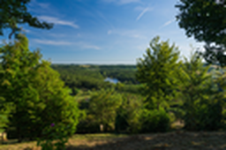 |  | 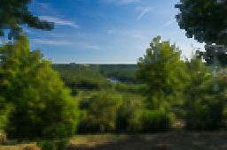 | 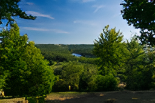 |
| Oak leaves         |        |        | 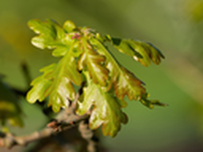       |        | 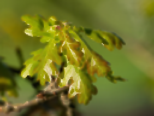       |        |
| Gold weight        |      | 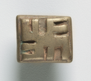     |      |      | 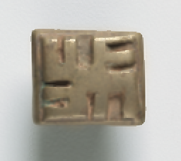     | 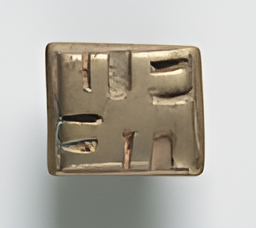     |
| Rome map           |            | 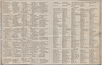           | 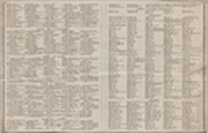           | 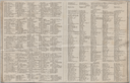           | 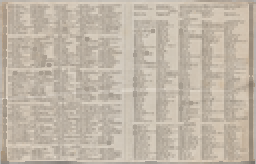           | 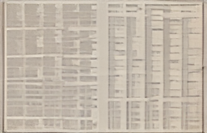           |

## Model status and remaining comparison

The two official general-image checkpoints are registered in [`docs/model-assets.json`](../../../../docs/model-assets.json), and their downloaded bytes were checked against the registered sizes and SHA-256 values. The project owner has explicitly accepted use of the upstream BSD-3 label for these exact `.pth` assets. The upstream model zoo identifies x2plus and x4plus as general-image models. `.pth` is a PyTorch checkpoint and cannot be opened directly by ONNX Runtime Web; both checkpoints were converted to dynamic-spatial ONNX and passed CPU parity. The actual x2 ONNX was also opened and run in Chromium through the pinned WASM runtime on a tiny seeded tensor, using same-origin runtime/model requests and no external requests. Conversion hashes and parity errors are in [`conversion/cpu-parity-report.json`](t32/conversion/cpu-parity-report.json).

The clean x2 comparison and Real-ESRGAN x4 comparison show no Tier 2 quality advantage on their tested pairs. Swin2SR has an exploratory, modest aggregate synthetic result but loses clean-class PSNR, runs slowly in the measured CPU/WASM smokes, and lacks established per-file licensing/training provenance; its metrics are not an asset-cleared model comparison and must not drive product selection. Keep Tier 1 as default and keep Swin2SR excluded from product decisions pending asset review. The `/upscale` route offers an explicit size-disclosed Tier 2 browser load/download with progress, cancellation, registered size/SHA-256 verification, IndexedDB reuse, and an inference probe; failed delivery preserves Tier 1. Focused Chromium route E2E streams the exact registered x2 bytes through a local test fixture, runs actual model inference on a generated 3×2 image, confirms the 6×4 result after even-dimension edge padding/crop, and verifies host-unavailable IndexedDB reuse after reload. A separate route E2E runs the registered x4 model on the same odd-size input and confirms its 12×8 result. The x2 checks also reject same-size SHA mismatch without fallback and prevent a cancelled partial transfer from being cached. These tests verify delivery plumbing and inference; they do not establish a fully offline app-shell/worker start, future production-host availability, or photo quality. The current public Hugging Face origin is third-party-controlled; configurable runtime URLs and optional fallbacks do not guarantee future availability. See [`T32 model hosting`](../../../../docs/t32-model-hosting.md). Real degraded-photo fixtures, representative image sizes, browser steady-state latency/memory, and full route STCC remain open. Do not generalize these synthetic results to every restoration task.
