# P4-21 benchmark: T66 inpaint / object removal

**Status:** Two narrow synthetic comparisons are measured for five local methods. They include three generated scenes and an eight-case CC0-derived synthetic-occlusion proxy. Real-image quality, larger natural-scale removals, and plausible structural reconstruction remain unmeasured.

## Method comparison

The repeatable benchmark is [`t66/run.mjs`](t66/run.mjs); raw results, per-scene metrics, runtime samples, and all image hashes and dimensions are in [`t66/results.json`](t66/results.json). It calls the exported `removeObject` controller with the same 8×8 opaque-magenta mask for every method. The 48×48 reference scenes are generated deterministically in code, and each exact pre-occlusion patch is retained as ground truth. No third-party image or model assets are used.

| Method              | Mean ROI PSNR (RGB) | Mean ROI SSIM | Median latency | p95 latency |
| ------------------- | ------------------: | ------------: | -------------: | ----------: |
| Telea               |          19.9944 dB |      0.678207 |       1.739 ms |    3.789 ms |
| Navier–Stokes       |          13.8012 dB |      0.384905 |       0.347 ms |    1.625 ms |
| Confidence-priority |           5.5982 dB |      0.251969 |       4.371 ms |    6.520 ms |
| Efros–Leung         |          20.0959 dB |      0.608839 |      40.967 ms |   50.660 ms |
| Quilting            |          14.3052 dB |      0.331379 |      29.685 ms |   35.402 ms |

The result has no single winner across these simple synthetic textures: Efros–Leung has the highest mean ROI PSNR, while Telea has the highest mean ROI SSIM. Navier–Stokes is quickest here but scores lower on both quality metrics. The labels identify repository implementations; this benchmark does not independently validate conformance to the named academic algorithms.

## Fixtures and measurements

| Generated scene |  Telea PSNR / SSIM | Navier–Stokes PSNR / SSIM | Confidence-priority PSNR / SSIM | Efros–Leung PSNR / SSIM | Quilting PSNR / SSIM |
| --------------- | -----------------: | ------------------------: | ------------------------------: | ----------------------: | -------------------: |
| Woven lattice   | 17.1905 / 0.573947 |        15.6674 / 0.450161 |               6.7774 / 0.367532 |      23.4961 / 0.865673 |   16.1078 / 0.500150 |
| Crossing bands  | 18.4435 / 0.636678 |        14.6844 / 0.465012 |               6.2203 / 0.228429 |      16.9756 / 0.429174 |   12.0311 / 0.069767 |
| Seeded cloud    | 24.3491 / 0.823995 |        11.0518 / 0.239541 |               3.7969 / 0.159947 |      19.8159 / 0.531669 |   14.7768 / 0.424220 |

Measurements used one warmup and five timed calls per scene and method in Node.js 22.22.0, Windows x64, Intel Core i7-10750H. Timing covers only `removeObject`; PNG encoding, metrics, and fixture generation are excluded. Aggregate p95 uses nearest-rank over 15 calls per method. PSNR is computed strictly inside the 64 masked pixels. SSIM averages 7×7 Gaussian-window local scores at those masked-pixel centers; each window also samples neighboring known pixels for context. The complete generator descriptions, exact PNG and RGBA SHA-256 hashes, raw mask hash, runtime metadata, individual timing samples, and formulas are recorded in `results.json`.

## Reviewable output samples

Each artifact below is one of the exact lossless PNGs whose dimensions and PNG/RGBA hashes are recorded in [`t66/results.json`](t66/results.json).

| Scene          | Exact reference                                                      | Masked input                                                                  | Telea                                                                  | Efros–Leung                                                                        |
| -------------- | -------------------------------------------------------------------- | ----------------------------------------------------------------------------- | ---------------------------------------------------------------------- | ---------------------------------------------------------------------------------- |
| Woven lattice  | 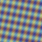   | 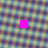   | 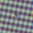   | 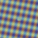   |
| Crossing bands | 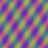 | 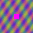 | 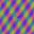 | 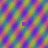 |
| Seeded cloud   | 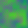     | 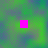     | 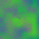     | 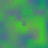     |

## CC0-derived synthetic-occlusion proxy

An additive benchmark at [`t66/cc0-run.mjs`](t66/cc0-run.mjs) supplements the generated-texture comparison above without replacing it. It uses four individually registered CC0 source images from [`fixtures/cc0/manifest.json`](fixtures/cc0/manifest.json). Before generating outputs, the runner verifies the source bytes and item-level metadata hashes. For each source, it creates two fixed 256×256 source crops, resamples them with Lanczos3 to 32×32, then applies a known synthetic occlusion: one 6×6 interior rectangle and one irregular stepped mask touching the left crop boundary. The pre-occlusion pixels are the reference by construction.

[`t66/cc0-results.json`](t66/cc0-results.json) records all eight cases, per-case measurements, runtime samples, and dimensions plus PNG and decoded-RGBA hashes for 64 artifacts (reference, masked input, mask, and five method outputs per case) under [`t66/cc0-artifacts/`](t66/cc0-artifacts/). Across the eight cases, the method means and latency summaries are:

| Method              | Mean masked-region PSNR (RGB) | Mean masked-region SSIM | Median / p95 latency (ms) |
| ------------------- | ----------------------------: | ----------------------: | ------------------------: |
| Telea               |                    25.3583 dB |                0.610996 |             0.900 / 3.091 |
| Navier–Stokes       |                    13.1290 dB |                0.208173 |             0.320 / 3.882 |
| Confidence-priority |                     5.8823 dB |                0.253917 |             2.721 / 9.328 |
| Efros–Leung         |                    22.1028 dB |                0.437460 |           13.425 / 22.323 |
| Quilting            |                    19.5491 dB |                0.390240 |           10.930 / 18.912 |

Telea led the aggregate masked-region PSNR and SSIM on this proxy set; Navier–Stokes had the lowest median latency. Each output is required to preserve all unmasked RGBA pixels and the 32×32 dimensions. The run used one warmup and three timed calls per case/method; p95 is nearest-rank over 24 calls per method. Timing measures the synchronous `removeObject` operation in Node, excluding decode, crop/resampling, PNG output, and scoring.

Reproduce from the repository root after building the engine and verifying the registered CC0 sources:

```sh
pnpm --filter @complianttools/image-engine build
node scripts/verify-p4-21-cc0-fixtures.mjs
node packages/engine/bench/escalation/t66/cc0-run.mjs
```

This set is a synthetic-occlusion proxy over downsampled photographs, not a benchmark of genuine object removal: no object was removed and no plausible replacement scene was annotated. Its 32×32 inputs, eight masks, known hidden pixels, and Node CPU timings do not establish quality for larger fills, real objects, structured scenes, natural-scale images, or user preference. Treat these measurements separately from the three generated-texture cases above.

## Shortfall

Across both local comparisons, evidence remains narrow: three generated 48×48 textures and eight CC0-derived 32×32 synthetic occlusions. The latter adds an irregular edge-touching mask but still does not measure real object removal or plausible structural reconstruction. Larger fills, varied real-object masks, natural-scale processing, and user judgments remain open. A broader compliant corpus with annotated real removals would be needed to measure those gaps. Keep model-dependent comparisons open until their exact assets are approved and run through the intended runtime on the same fixtures.
